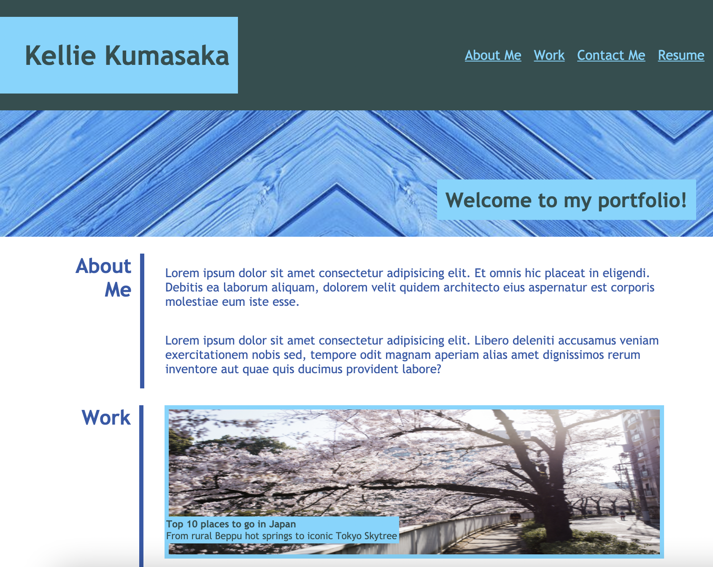
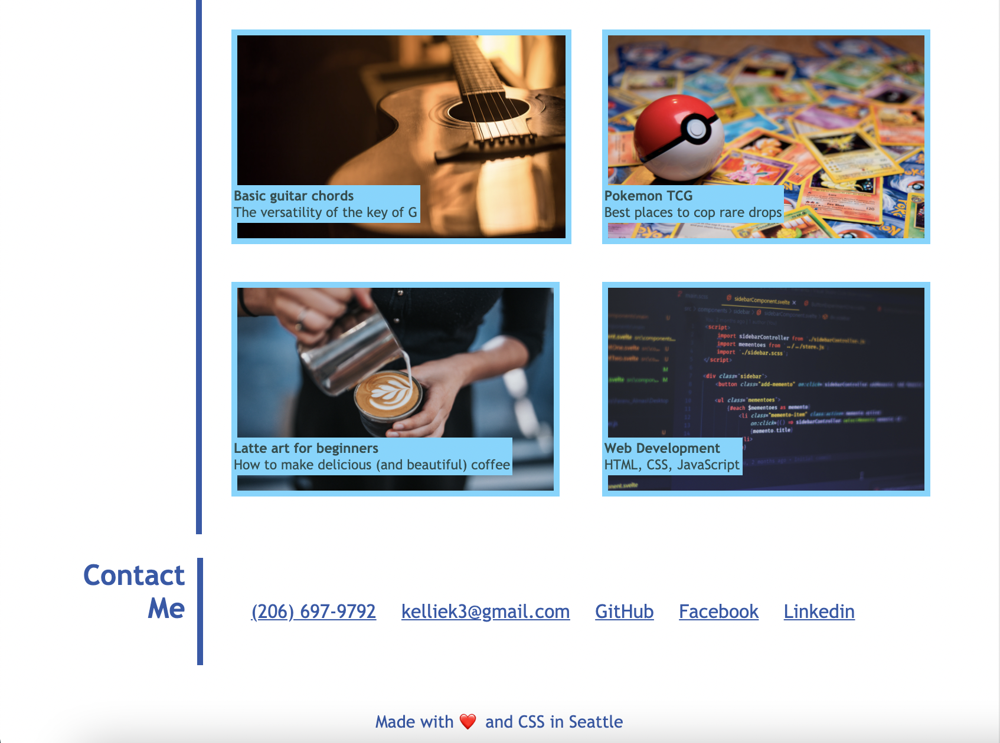

# professional-portfolio

This assignment was to create a portfolio that will, eventually, have a compilation of information and work, including my resume, that future employers can easily find and navigate. 

## Deployment

The following [link](https://kelliekumasaka.github.io/professional-portfolio/) will take you to the website. 

## Content 

The portfolio includes a working navigation bar, a subtitle with a background image, as well as an about me section, collage section for my future works, and links to contact me.

The following screenshots show my portfolio in its entirety. 

When you scroll over the work section, the images should be faded as you hover your cursor, which will also change shape. Also, if you change the size of the window, the padding on the body should change with it.

## Summary

Although not near to perfect, my portfolio fulfills most of the acceptance criteria provided and will function as a good portfolio website in the future.